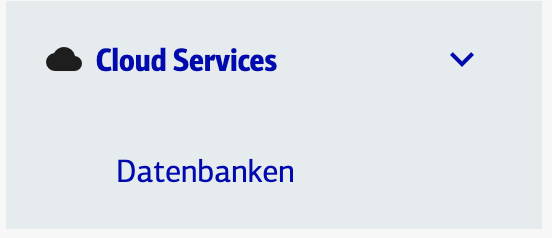
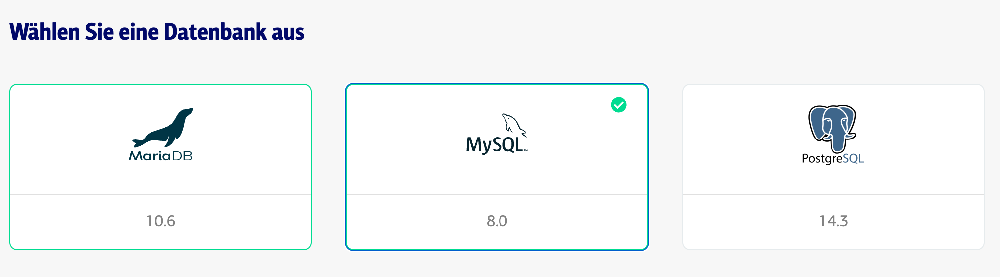
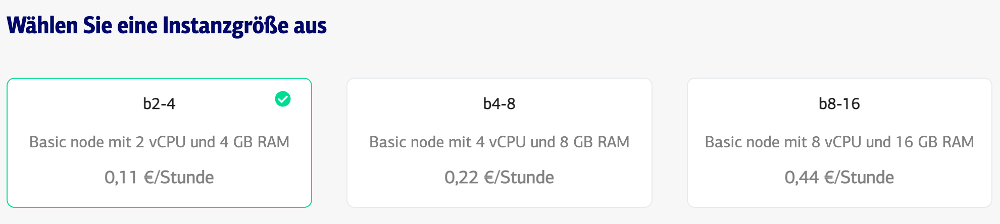
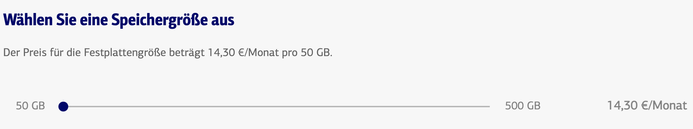
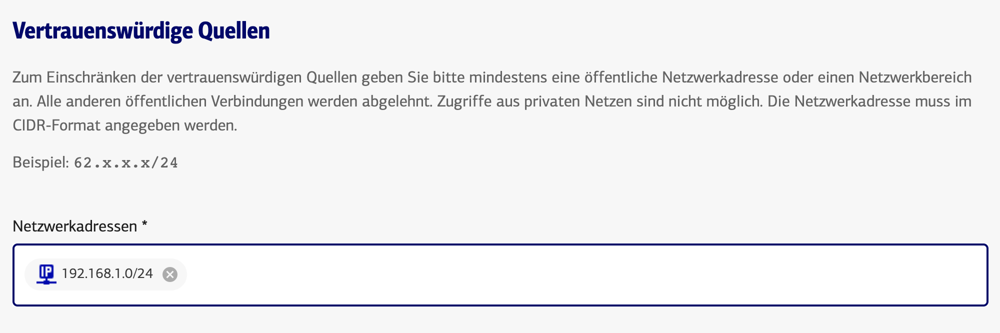
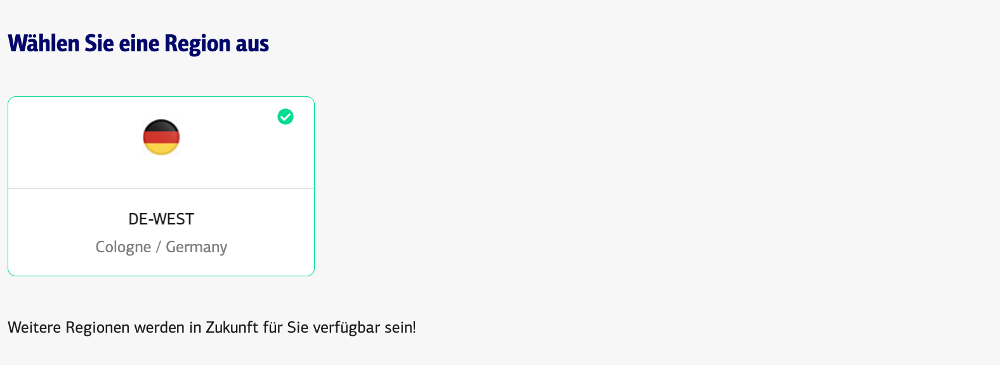
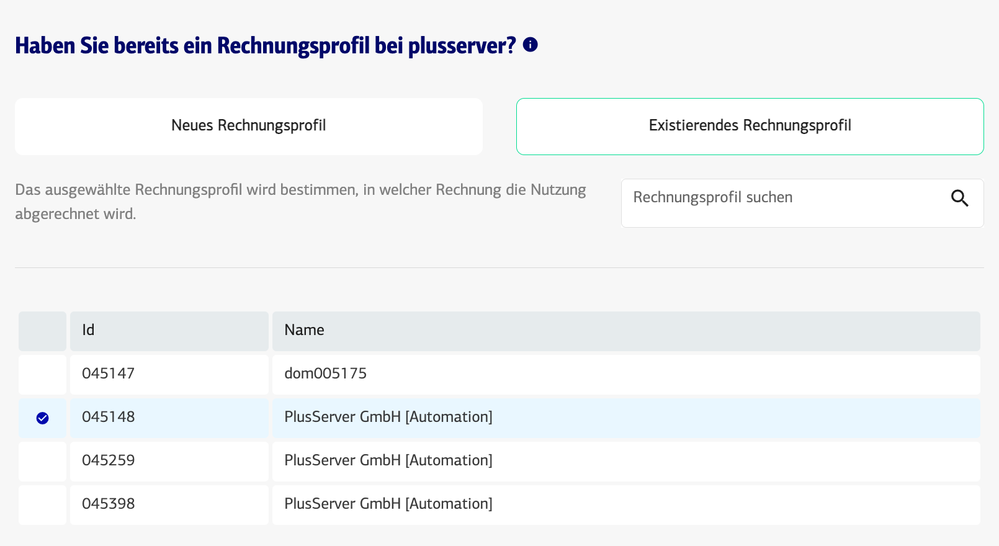
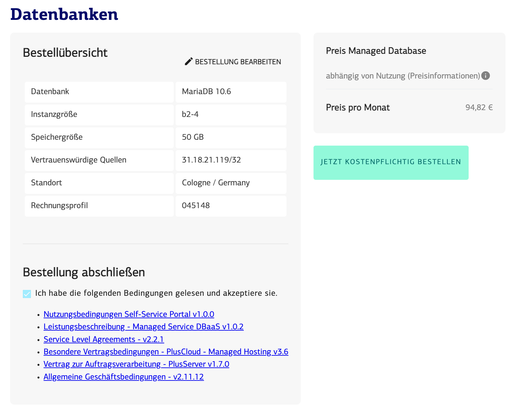
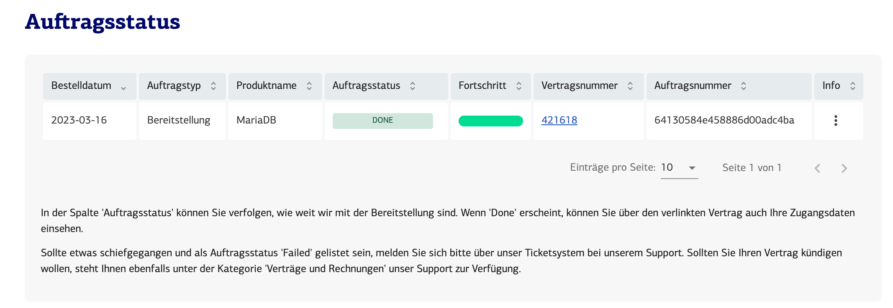

# Bestellung
Sie benötigen schnell eine Datenbank? Dann führen wir Sie hier durch die Bestellung:

### Kundenportal
Sie starten immer in unserem [Kundenportal](https://customerservice.plusserver.com)

### Auswahl DBaaS
Navigieren Sie zunächst zu ***Cloud Services / Datenbanken***

### Auswahl DBaaS
Wählen Sie die benötigte Datenbank aus

### Auswahl Nodesize
Wählen Sie nun die Größe bzw. Leistungsfähigkeit aus. Sie wissen noch nicht welche Leistung Sie benötigen? Dann wählen Sie die kleinste Node udn skallieren bei Bedarf später

### Auswahl der Speichergröße
Sie starten immer mit mindestens 50GB Speicher für Ihre Daten. 

### Freischalten des Zugriffs
Sie müssen hier den Zugriff von einer oder mehrer externen Adressen oder Adressberechen freischalten.

### Auswahl der Region

### Auswahl des Rechnungsprofils
Sie sind neuer Kunde bei Plusserver und bekommen noch keine Rechnung? Dann wählen Sie ***Neues Rechnungsprofil***. Sind Sie bereits Kudne können Sie aus bereits bestehenden Rechnungsprofilen wählen und bekommen die neue DBaaS mit auf eine bestehende Rechnung, diese müssen Sie dann auswählen. Natürlich können Sie ebenfalls ***Neues Rechnungsprofil*** auswählen.

### Auslösen der Bestellung
Prüfen Sie bitte über die Zusammenfassung Ihre eingegeben Daten. Lesen Sie bitte die Bestimmungen und Vereinbarungen und bestätigen diese. Erst danach können Sie ***jetzt kostenpflichtig bestellen*** klicken

### Bestellstatus verfolgen
Direkt nach der Bestellung werden Sie auf [Bestellstatus](https://customerservice.plusserver.com/order-status) weitergeleitet. Sie können hier jederzeit den Status laufender Aufträge einsehen.

* new: Status direkt nach dem Auftrag
* processing: Status sobald die automatische bereitstellung angelaufen ist
* failed: Es ist leider etwas schiefgegangen, bitte öffnen Sie ein [Ticket](https://customerservice.plusserver.com/support/ticket-create)
* DONE: Herzlichen Glückwunsch, Ihr neuer DBaaS steht zur Verfügung

### Zugangsdaten einsehen
Direkt nach der bestellung können sie vom Auftrag aus direkt zum Vertrag springen. Dort finden Sie die Zugangsdaten.
Sie können die Zugangsdaten aber auch jederzeit über die [Verträge](https://customerservice.plusserver.com/billing/contracts) finden. Mehr Details finden Sie in dieser [Anleitung](https://docs.xaas.get-cloud.io/de/docs/01-dbaas/03-howto/zugangsdaten) 

### Erste Schritte mit dem Service
Schauen Sie hier bitte in unsere Anleitungsartikel
* [Zur Datenbank verbinden](https://docs.xaas.get-cloud.io/de/docs/01-dbaas/03-howto/db-login)
* [User und Passworte anlegen](https://docs.xaas.get-cloud.io/de/docs/01-dbaas/03-howto/anlegen-neuer-datenbanken-und-user)

# Anpassung
Feature kommt in Q2 2023

# Kündigung
Feature kommt im April 2023
