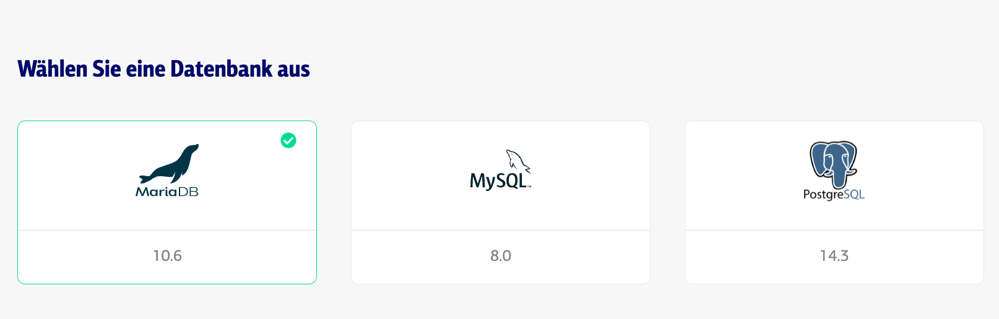
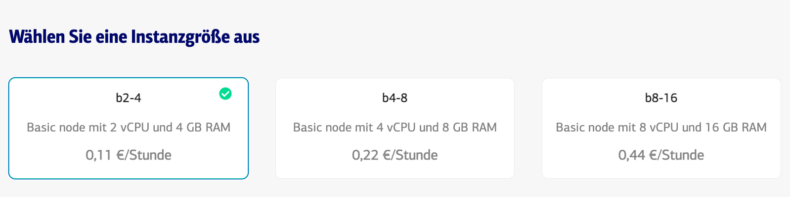
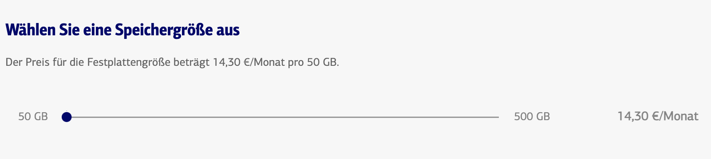
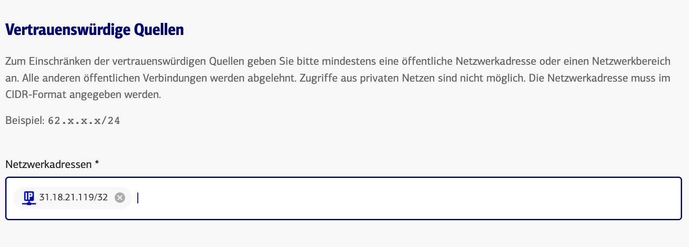
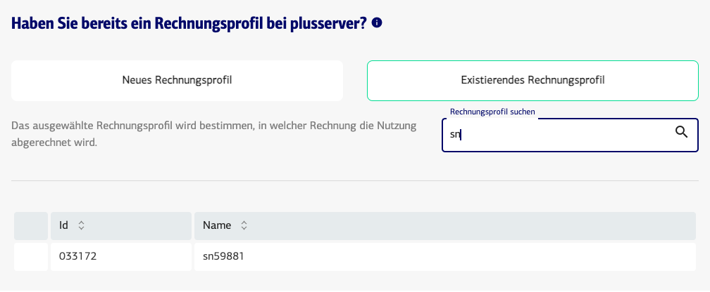

# Bestellung
Sie benötigen schnell eine Datenbank? Dann führen wir Sie hier durch die Bestellung:

### Kundenportal
TBD: Einstieg: Link zum Kundenportal

### Auswahl DBaaS
Navigieren Sie zunächst zu ***Cloud Services / Datenbanken***

### Auswahl DBaaS
Wählen Sie die benötigte Datenbank aus

### Auswahl Nodesize
Wählen Sie nun die Größe bzw. Leistungsfähigkeit aus. Sie wissen noch nicht welche Leistung Sie benötigen? Dann wählen Sie die kleinste Node udn skallieren bei Bedarf später

### Auswahl der Speichergröße
Sie starten immer mit mindestens 50GB Speicher für Ihre Daten. 

### Freischalten des Zugriffs
Sie müssen hier den Zugriff von einer oder mehrer externen Adressen oder Adressberechen freischalten.

### Auswahl der Region

### Auswahl des Rechnungsprofils
Sie sind neuer Kunde bei Plusserver und bekommen noch keine Rechnung? Dann wählen Sie ***Neues Rechnungsprofil***. Sind Sie bereits Kudne können Sie aus bereits bestehenden Rechnungsprofilen wählen und bekommen die neue DBaaS mit auf eine bestehende Rechnung, diese müssen Sie dann auswählen. Natürlich können Sie ebenfalls ***Neues Rechnungsprofil*** auswählen.

### Auslösen der Bestellung
Prüfen Sie bitte über die Zusammenfassung Ihre eingegeben Daten. Lesen Sie bitte die Bestimmungen und Vereinbarungen und bestätigen diese. Erst danach können Sie ***jetzt kostenpflichtig bestellen*** klicken

### Was jetzt
TBD:
* Bestellstatus verfolgen
* Zugangsdaten einsehen

# Anpassung
Comming Soon

# Kündigung
Comming Soon
