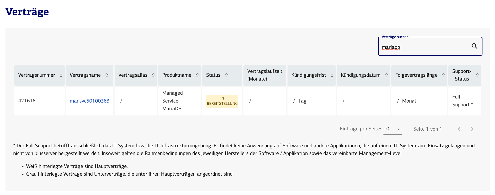
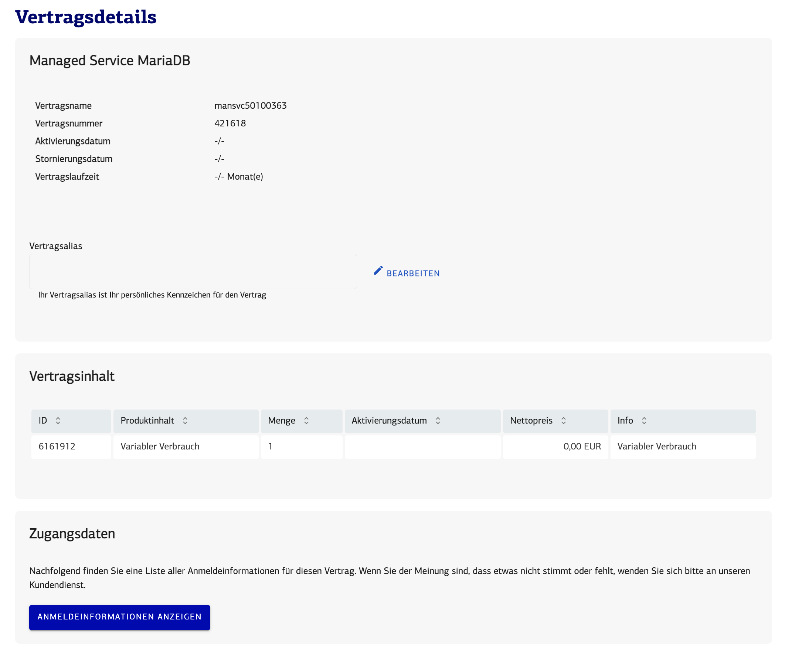
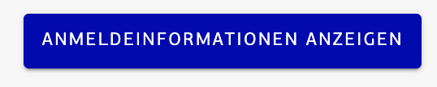

### Auswahl des Vertrags
Suchen Sie zunächst den passenden [Vertrag](https://customerservice.plusserver.com/billing/contracts)
Die Suchbegriffe MySQL, PostgreSQL, MariaDB aber auch mansvc werden ihnen die Auswahl erleichtern

### Vertragsdetails anzeigen lassen
Gehen Sie auf den Vertrag und lassen sich am unteren Ende der Vertragsdetails die Anmeldedaten Anzeigen anzeigen

dazu müssen Sie 

auswählen

### Anmeldedaten

Sie können sich nun mit diesen Daten an ihren DBaaS anmelden. Wenn Sie Hilfe benötigen schauen Sie bitte in folgende [Anleitung](https://docs.xaas.get-cloud.io/de/docs/01-dbaas/03-howto/db-login)

